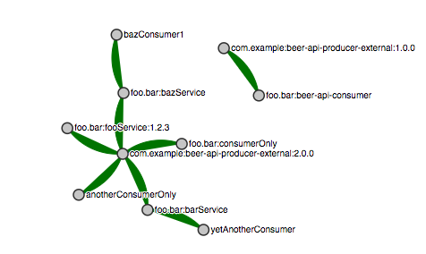
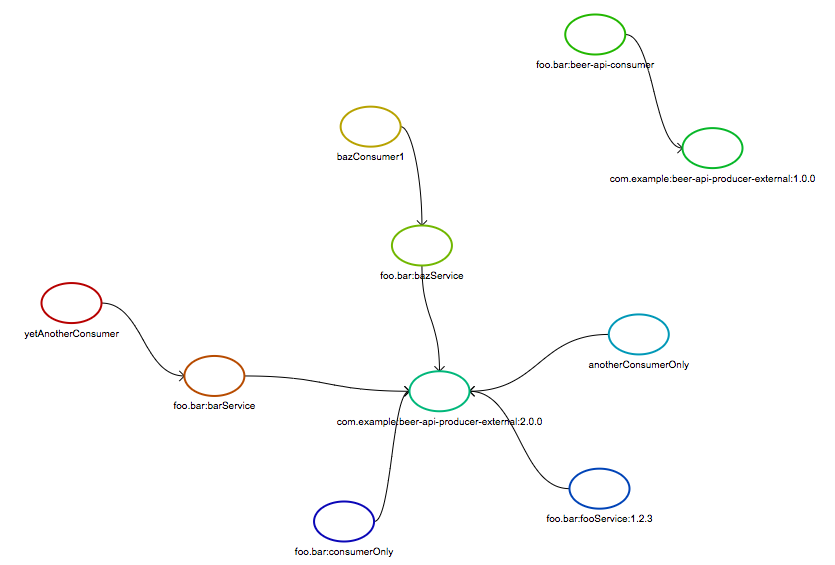

= Common contracts repo

This repo contains all contracts for apps in the system.

== As a consumer

You are working offline in order to play around with the API of the producer.
What you need to do is to have the producer's stubs installed locally. To do that
you have to (from the root of the repo)

[source,bash]
----
cd src/main/resources/contracts/com/example/beer-api-producer-external/1.0.0
mvn clean install -DskipTests
----

Then if you do `ls ./target` you'll see `beer-api-producer-external-0.0.1-SNAPSHOT-stubs.jar`. This jar will
 contain the stubs generated from your contracts. That way you
can reference the `com.example:server:+:stubs` dependency in your consumer tests.

TIP: Don't mind that there's a version mismatch in the stubs and the folder structure.
The version number is there in the folder name for tests related to dealing with
non-Java friendly naming of packages.

== As a producer

Assuming that the consumers have filed a PR with the proposed contract the producers
can work offline to generate tests and stubs. To work offline, as a producer you just have
to go to the root folder of the contracts and:

[source,bash]
----
./mvnw clean install -DskipTests
----

Then if you do `ls ./target` you'll see `contracts-0.0.1-SNAPSHOT.jar`. This file contains
all DSL contracts, for all applications.

Now the producer can include the `contracts-0.0.1-SNAPSHOT.jar` from your local maven repository.
You can achieve that by setting the proper flag in plugin properties.

Example for Maven

[source,xml]
----
<plugin>
    <groupId>org.springframework.cloud</groupId>
    <artifactId>spring-cloud-contract-maven-plugin</artifactId>
    <configuration>
        <!-- url not required for working locally -->
        <contractsMode>LOCAL</contractsMode>
        <contractDependency>
            <groupId>com.example</groupId>
            <artifactId>beer-contracts</artifactId>
        </contractDependency>
    </configuration>
</plugin>
----

and for Gradle:

[source,groovy]
----
contracts {
    contractsMode = "LOCAL"
    contractDependency {
        stringNotation = "com.example:beer-contracts"
    }
}
----

== Dependency Visualization

When keeping contracts in an external repository, and by following the
stubs per consumer feature, we have the full knowledge of who is
calling who within our system. That way we can sketch a graph of dependencies
between applications.

As a reminder, the **stubs per consumer** feature is all about creating a
consumer subfolder, in each producer's folder. E.g. if consumer `baz` uses producer `foo.bar`
then the folder structure would look like this `foo/bar/baz/contracts/...`.

Let's assume that we have such setup (`...` signifies contract definitions):

[source]
----
├── com
│   └── example
│       └── beer-api-producer-external
│           ├── 1.0.0
│           │   ├── beer-api-consumer
│           │   │   ├── messaging
│           │   │   │   ├── ...
│           │   │   └── rest
│           │   │       ├── ...
│           │   ├── mvnw
│           │   ├── pom.xml
│           └── 2.0.0
│               ├── anotherConsumerOnly
│               │   ├── ...
│               ├── barService
│               │   ├── ...
│               ├── foo.bar.bazService
│               │   ├── ...
│               ├── foo.bar.consumerOnly
│               │   ├── ...
│               ├── foo.bar.fooService.1_2_3
│               │   ├── ...
│               └── pom.xml
└── foo
    └── bar
        ├── barService
        │   ├── pom.xml
        │   └── yetAnotherConsumer
        │       ├── ...
        ├── bazService
        │   ├── bazConsumer1
        │   │   └── rest
        │   │       └── ...
        │   └── pom.xml
        ├── beer-api-consumer
        │   ├── messaging
        │   │   ├── ...
        │   ├── pom.xml
        │   └── rest
        │       ├── ...
        └── fooService
            └── 1.2.3
                ├── ...
                └── pom.xml
----

We can reason that:

* `com.example:beer-api-producer-external` in version `2.0.0` is used by 5 consumers
** `foo.bar:bazService`
** `foo.bar:barService`
** `anotherConsumerOnly`
** `foo.bar:fooService` in version `1.2.3`
** `foo.bar:consumerOnly`
* `com.example:beer-api-producer-external` in version `1.0.0` is used by 1 consumer
** `foo.bar:beer-api-consumer`
* `foo.bar:bazService` is used by 1 consumer
** `bazConsumer1`
* `foo.bar:barService` is used by 1 consumer
** `yetAnotherConsumer`

This information gives as all data we need to sketch a graph of the dependencies.

.Example of d3 graph

.Example of Dracula graph

=== Storing data

It's enough to execute the `docs.GenerateGraphFromContractsTests.java`. The test
scans the contract structure and builds a graph of relationships between
consumers and producers.

It will create a file called `relationships.js` that you can source in
your HTML file. It will load to a var called `relationships` the JSON representing
the relationships. The JSON consists of `source`, `target` pairs where `source` is
the `producer` and `target` is the `consumer`.

There are two example HTML files `relationships_d3.html` that uses http://d3js.org/[d3js]
and `relationships_dracula.html` that uses https://www.graphdracula.net[Graph Dracula] to
render the graph.

=== Assumptions

* You have to use the stubs per consumer feature to sketch a precise graph
(i.e. each consumer has its own subfolder in the producer's directory)
* If using the producer contract approach (you don't know who your consumers are)
you can create file `.producer_contracts` that will tell the test that
generates data that the subfolders do not represent consumer names
* The folder where the consumers of a given producer lay, needs to have the `pom.xml`
or `build.gradle` file (you need it anyways to, as a consumer, install stubs of the producer)
